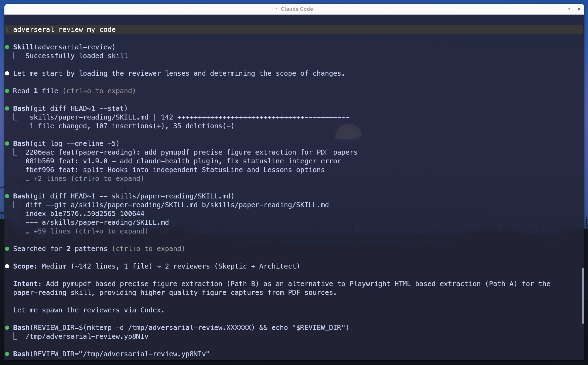
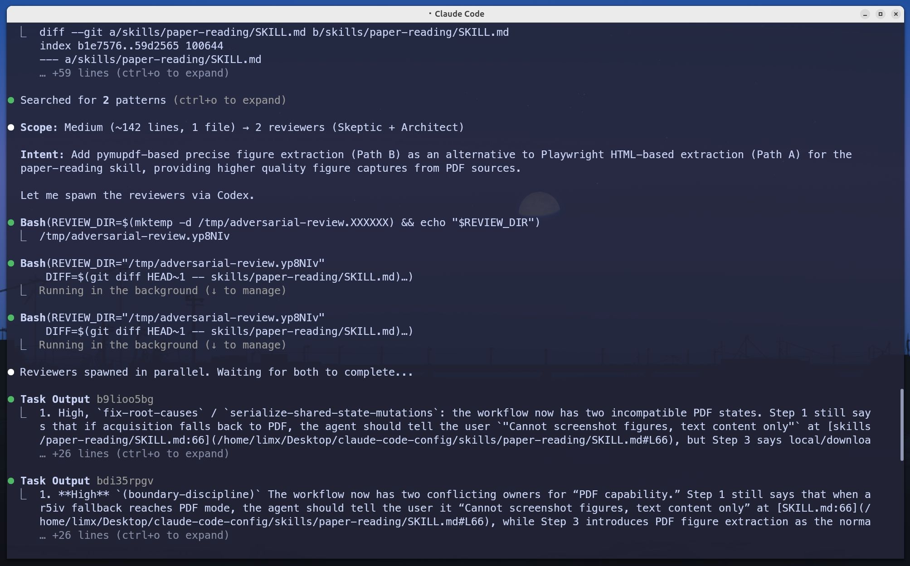
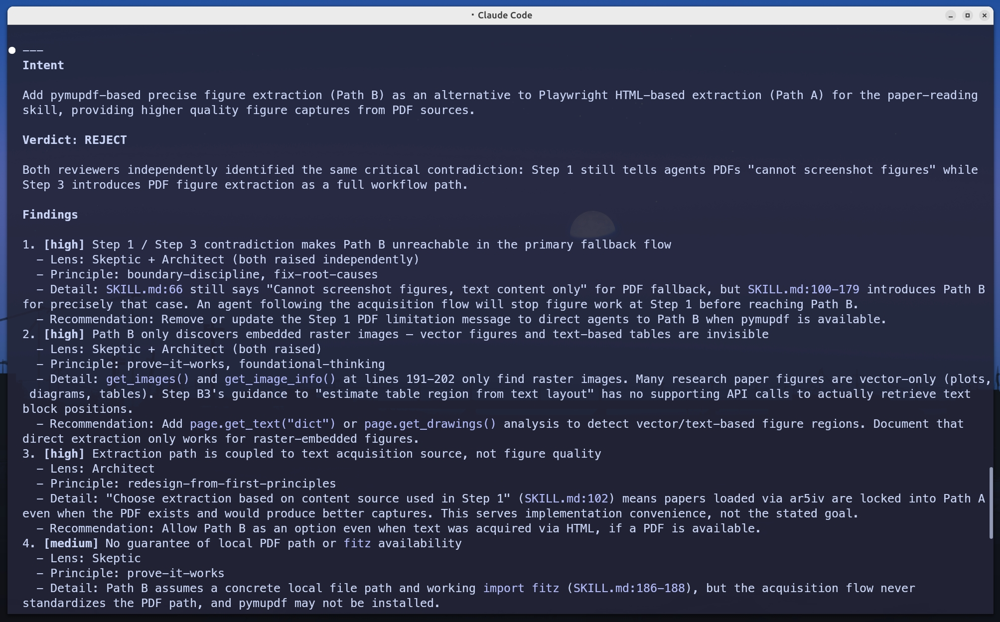
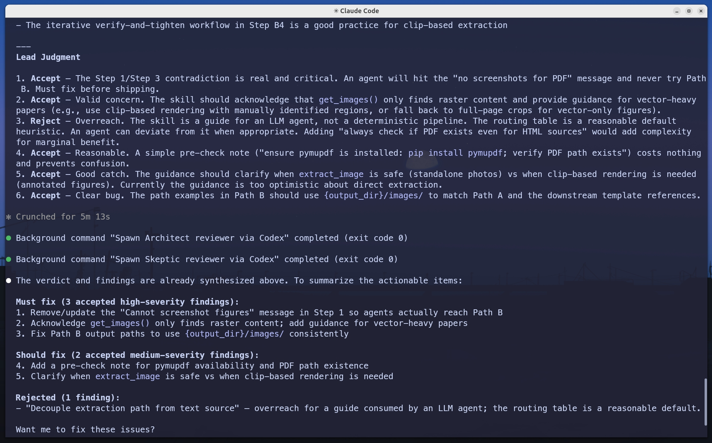

# Adversarial Review Showcase

Cross-model adversarial code review in action. Claude spawns Codex reviewers (via `codex exec`) with distinct critical lenses (Skeptic + Architect), then synthesizes a structured verdict.

## Step 1 - Load lenses and determine scope

Reads reviewer lenses, analyzes recent diffs, and determines review scope (Small / Medium / Large) with the appropriate number of reviewers.

## Step 2 - Spawn reviewers on the opposite model

Creates a temp directory, spawns Skeptic and Architect reviewers in parallel via `codex exec`, each receiving the diff, their assigned lens, and adversarial instructions.

## Step 3 - Synthesize verdict

Reads both reviewers' output, deduplicates overlapping findings, and produces a structured verdict (PASS / CONTESTED / REJECT) with severity-ordered findings.

## Step 4 - Lead judgment

Applies independent judgment on each finding — accepts valid concerns, rejects overreach — with one-line rationale for each decision.

